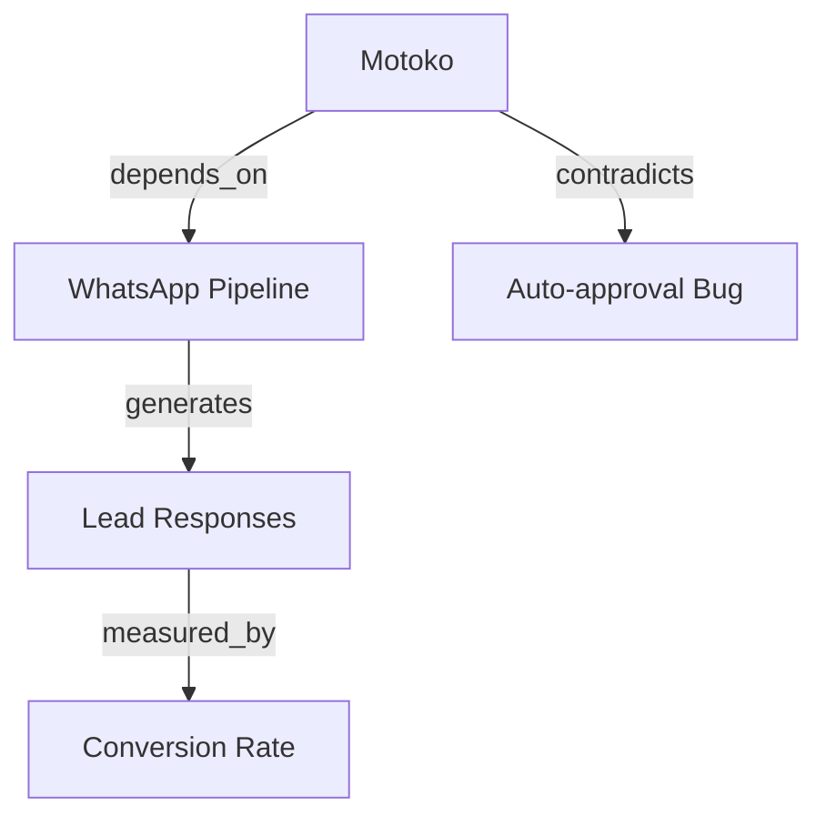

# SKILL: GRAPH
# Build, query, and visualize the knowledge graph derived from wiki frontmatter.

## Trigger
`/graph` — rebuild graph and show stats
`/graph communities` — show detected clusters
`/graph path <entity_a> <entity_b>` — find shortest path
`/graph neighbors <entity>` — show all connected nodes
`/graph gaps` — find structural holes in the graph

## Prerequisites
Neo4j must be running: `docker compose up -d`
Schema must be initialized: `python scripts/neo4j_config.py --init`

## Architecture
The graph is DERIVED from wiki frontmatter `relations:` blocks and stored in Neo4j.
Wiki is source of truth. Neo4j is the queryable index. Graph can always be rebuilt.
Nodes carry vector embeddings (384d, all-MiniLM-L6-v2) for semantic search.

### Nodes
Every wiki page = one node. Attributes:
- `id`: page path (e.g., `entities/motoko`)
- `type`: entity | concept | source | output
- `tldr`: the page's TLDR (for quick context)
- `confidence`: high | medium | low
- `source_count`: number of citations
- `last_updated`: timestamp

### Edges (Typed)
From frontmatter `relations:`:
- `DEPENDS_ON` — functional dependency
- `GENERATES` — production relationship
- `CITES` — provenance link to source
- `CONTRADICTS` — bidirectional conflict
- `SUPERSEDES` — temporal replacement (directional)
- `MEASURED_BY` — evaluation relationship
- `DERIVED_FROM` — query/analysis origin
- `ENABLES` — causal positive
- `BLOCKS` — causal negative
- `RELATED_TO` — semantic association (weakest)

From `[[wikilinks]]` in page body:
- `MENTIONS` — extracted from body text, weaker than frontmatter relations

## Build Pipeline
```bash
python scripts/graph_builder.py
```
1. Scan all markdown files in `wiki/`
2. Parse YAML frontmatter → extract `relations:` block
3. Parse body → extract `[[wikilinks]]` → create MENTIONS edges
4. Generate vector embeddings for all node TLDRs
5. MERGE nodes + edges into Neo4j (upsert, idempotent)
6. Remove orphaned nodes (deleted wiki pages)

Additional flags:
- `--stats` — build + show statistics
- `--communities` — build + run community detection
- `--full-rebuild` — clear all nodes/edges, rebuild from scratch
- `--dry-run` — parse wiki, show what would change, don't write

## Query Pipeline
```bash
python scripts/graph_query.py "<keywords>"
```
1. Full-text search on Neo4j (keyword matching on id, tldr, type)
2. Vector similarity search (semantic matching on TLDR embeddings)
3. Combine scores (0.6 text + 0.4 vector)
4. 2-hop Cypher graph expansion from top 5 seeds
5. Return top 15 ranked nodes with connecting edges

## Edge Weights for Retrieval
When scoring retrieval relevance:
- `DEPENDS_ON` / `GENERATES` / `ENABLES` / `BLOCKS` = 1.0 (strongest)
- `CITES` / `DERIVED_FROM` = 0.9 (provenance chain)
- `CONTRADICTS` / `SUPERSEDES` = 0.8 (conflict resolution)
- `MEASURED_BY` = 0.7 (evaluation)
- `RELATED_TO` = 0.4 (weak semantic)
- `MENTIONS` = 0.2 (weakest — just appears in text)

## Community Detection
Uses Neo4j GDS Louvain algorithm on the weighted graph (falls back to BFS connected
components if GDS is not available).
Each community = a knowledge cluster.
Output: cluster label, member nodes, intra-cluster density, bridge nodes.
Community IDs are stored as `community_id` property on WikiNode nodes.

Bridge nodes (high betweenness centrality) = entities that connect different
knowledge domains. These are the most valuable nodes for cross-domain queries.

## Gap Detection
Structural gaps = pairs of communities with NO bridge nodes.
These represent knowledge domains that SHOULD be connected but aren't.
Report as: "Community A (topic X) and Community B (topic Y) have no connections.
Consider: what relates X to Y?"

## Visualization
When asked, generate a Mermaid diagram of the graph or a subgraph:

